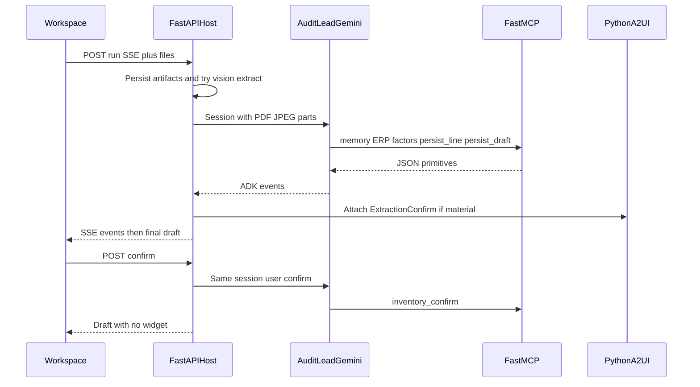

# GreenChain architecture

Judge-facing stack for **The Collaborative Partner**. One job, not a chatbot: the left column finishes the close; the right column is a single material gate; Firestore (or the local file store) is the notebook.

Poster for Devpost: [architecture.png](architecture.png).



```
ANALYST WORKSPACE  (Next.js / React on Cloud Run)
┌─────────────────────────────────────────────────────────────┐
│  Period pack dropzone (multimodal)                          │
│   CSV  ·  PDF bill  ·  invoice photo                        │
│                                                             │
│  [ Run audit ]     draft appears WITHOUT questions          │
│                                                             │
│  RESULTS                 │  COLLABORATION (A2UI v0.9)       │
│  GHG draft inventory     │  ExtractionConfirm               │
│  confidence + evidence   │  basic catalog only              │
│  Policy applied chip     │  answers become company policy   │
└────────────────────────────┴─────────────────────────────────┘
               │  HTTP + SSE job log
               ▼
AUDIT LEAD  —  Gemini 3.5 Flash  —  Google ADK  —  Cloud Run
       │
       │  1. Native PDF/JPEG parts on the ADK session
       │  2. MCPToolset → FastMCP HTTP primitives
       │  3. Persist draft  4. Host attaches A2UI after the turn
       │  5. Confirm is a second ADK turn on the same session
       ▼
┌─────────────────────────┐    ┌────────────────────────────┐
│  TOOLS (MCPToolset →    │    │  FIRESTORE / file fallback │
│  FastMCP HTTP service)  │    │  • draft inventory         │
│  • ERP from this run    │    │  • evidence + audit log    │
│  • Emission factors     │    │  • company override memory │
│  • persist line/draft   │    │  • ADK session ids         │
└─────────────────────────┘    └────────────────────────────┘
               │
               ▼
        Vertex AI logs  +  three Cloud Run URLs
```

## Engine switch

Default when ADK + Vertex + MCP are healthy: `engine: "adk"`. Otherwise `run_audit()` / `confirm_extraction()` with `engine: "deterministic"` and a visible `fallback` job-log line. If Vertex is down, extract `source=unavailable` and the close continues from tabular evidence only — sample-pack quantities are never injected.

Health (`GET /health`) is GreenChain-owned: `engine_default`, store backend, factor provider, ERP live flag, MCP URL/ok, and whether ADK is mounted. ADK’s built-in `/health` is removed so it cannot shadow this payload.

## Services

| Piece | Runtime | Notes |
| --- | --- | --- |
| `web/` | Next.js App Router on Cloud Run | One route `/`. Proxies `/api/audit/run` as SSE (`text/event-stream`). |
| `agent/` | Python ADK + FastAPI on Cloud Run | `audit_lead` orchestrator. ADK session + file parts when Vertex is up; deterministic `/api/audit/run` if vision/ADK/MCP is down. |
| `mcp/` | FastMCP HTTP on Cloud Run | Primitive ERP, factor, persist, memory tools. Agent uses MCPToolset (`MCP_URL`). This is a running HTTP service, not only compatible wrappers. |
| Store | Firestore `us-central1` or `agent/data/` | `GREENCHAIN_STORE=firestore` or `file`. |

A2UI is **never** generated by Gemini. After tools return, `pipeline/a2ui.py` attaches ExtractionConfirm when a line has two plausible readings and the tCO₂e delta is more than 5% of company total. Confirm continues the same ADK session so Vertex logs a second `generateContent`.

The Workspace job log streams `session` / `model` / `extract` / `tool_call` / `tool_result` / `gate` / `fallback` events over SSE, then the final draft JSON.

## Material gate

When vision (or extract JSON) yields two units for the same activity and the tCO₂e delta is more than 5% of the company total, the host attaches ExtractionConfirm. The answer is stored at `companies/{company_id}/overrides/{activity_key}_unit`. The next run for that company loads the key first and does not emit a widget.

Example packs under `fixtures/samples/` are for tests and docs only. They are not loaded at runtime unless uploaded as ordinary files.
