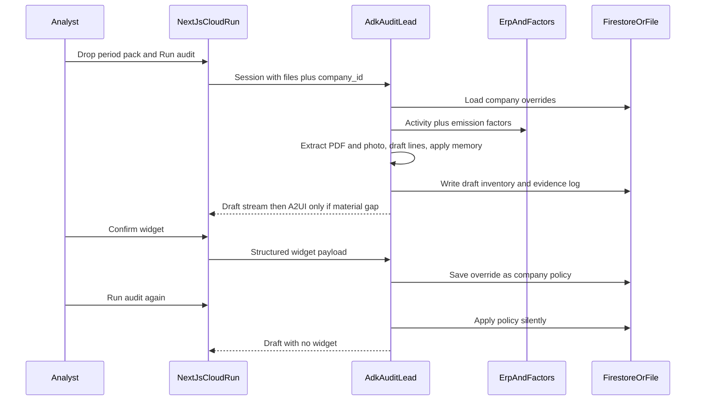

# GreenChain architecture

Judge-facing stack for **The Collaborative Partner**. One job, not a chatbot: the left column finishes the close; the right column is a single material gate; Firestore (or the local file store) is the notebook.



```
ANALYST WORKSPACE  (Next.js / React on Cloud Run)
┌─────────────────────────────────────────────────────────────┐
│  Period pack dropzone (multimodal)                          │
│   CSV  ·  PDF bill  ·  invoice photo                        │
│                                                             │
│  [ Run audit ]     draft appears WITHOUT questions          │
│                                                             │
│  RESULTS                 │  COLLABORATION (A2UI v0.9)       │
│  GHG draft inventory     │  ExtractionConfirm               │
│  confidence + evidence   │  basic catalog only              │
│  Policy applied chip     │  answers become company policy   │
└────────────────────────────┴─────────────────────────────────┘
               │  HTTP + ADK event stream
               ▼
AUDIT LEAD  —  Gemini 3.5 Flash  —  Google ADK  —  Cloud Run
       │
       │  1. Parse every artifact
       │  2. Call tools  3. Draft inventory  4. Gate material gaps
       │  5. Read/write company memory
       ▼
┌─────────────────────────┐    ┌────────────────────────────┐
│  TOOLS (FunctionTool +  │    │  FIRESTORE / file fallback │
│  FastMCP HTTP)          │    │  • draft inventory         │
│  • ERP mock (activity)  │    │  • evidence + audit log    │
│  • Emission factors     │    │  • company override memory │
└─────────────────────────┘    └────────────────────────────┘
               │
               ▼
        Vertex AI logs  +  Cloud Run URL
```

## Services

| Piece | Runtime | Notes |
| --- | --- | --- |
| `web/` | Next.js App Router on Cloud Run | One route `/`. Proxies `/api/audit/*` to the agent. |
| `agent/` | Python ADK + FastAPI on Cloud Run | `audit_lead` orchestrator. Deterministic `/api/audit/run` so the demo cannot fail if vision is flaky. |
| `mcp/` | FastMCP HTTP | Thin wrappers of `get_erp_activity`, `lookup_factor`, `write_draft`, memory. |
| Store | Firestore `us-central1` or `agent/data/` | `GREENCHAIN_STORE=firestore` or `file`. |

## Planted material gate

`fixtures/electricity_bill.pdf` prints **184,200 kWh** and a **184.2 MWh equivalent** heading. First-run OCR attaches 184,200 to MWh (1000× error). A2UI asks the analyst to confirm kWh. The answer is stored at `companies/northwind-energy/overrides/electricity_unit` (or `agent/data/overrides/...`). The second run loads that key first and does not emit a widget.
